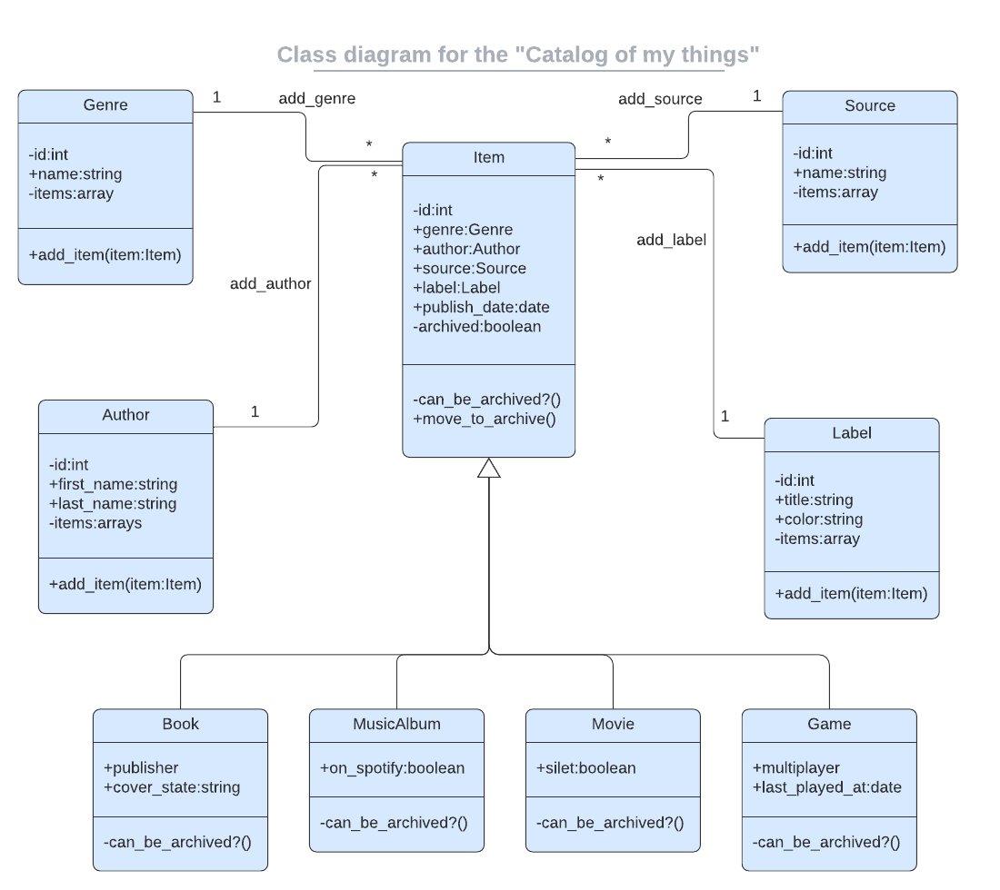

# Catalog of My Things
A console app that will help you to keep a record of different types of things you won: books, music albums, movies, and games. The data will be stored in JSON files, and will use a database with tables structure analogical the  program's class structure. Built with Ruby, JSON, and SQL.

UML class diagram:
</br>
<div align="center">
    
    <p>UML class diagram of Catalog of my things project</p>
</div>

## `Getting Started`
To get a local copy up and running follow these simple example steps :

Make sure you have `Ruby` installed in your machine.

Clone the project with the following command line : 
```
$ git clone git@github.com:KDlamini/Catalog-of-My-Things.git
```

Then move to the project root directory: 
```
$ cd Catalog-of-My-Things

$ gem install bundler

$ bundle install
```
Start the app on your terminal:
 ```
 $ ruby main.rb
 ``` 

 ## `Built With`

 - Ruby  
 - PostgreSQL 
 
</br>

## `Tests`

### To run Rspec tests:
```
$ gem install rspec

$ rspec ./spec
```

### To track linter errors locally follow these steps:

Track Ruby linter errors run:
```
$ rubocop
```
To auto-correct correctable Rubocop offenses run:
```
$ rubocop --auto-correct-all | rubocop -A
```

## `Authors`

👤 **Simo Nkosi**

- GitHub: [@KDlamini](https://github.com/KDlamini)
- Twitter: [@RealSimoNkosi](https://twitter.com/RealSimoNkosi)
- LinkedIn: [LinkedIn](https://www.linkedin.com/in/simo-nkosi-418523180/)

👤 **Mohamed Badr**

- GitHub: [@mbdesigns1989](https://github.com/mbdesigns1989)
- LinkedIn: [mohamed badr](https://www.linkedin.com/in/mohamed-badr-mb/)


## 🤝 Contributing

Contributions, issues, and feature requests are welcome!

Feel free to check the [issues page](https://github.com/KDlamini/Catalog-of-My-Things/issues).

## Show your support

Give a ⭐️ if you like this project!

## Acknowledgments

- This project is part module 4 Capstone week in the Microverse study program.
- Thanks to the Microverse team for the great curriculum.
- Thanks to Code Reviewers for the insightful feedback.
- A great thanks to My coding partners, morning session team, and standup team Partners for their contributions.

## 📝 License

This project is [MIT](./LICENSE) licensed.
